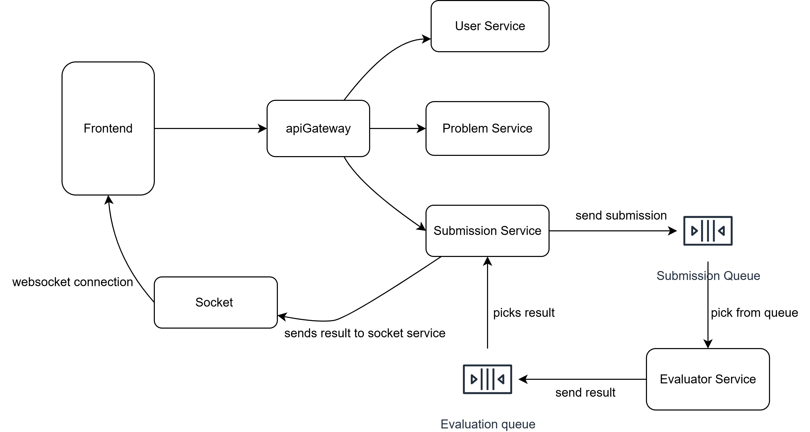

# CodeNest - Online Judge System

A modern, scalable Online Judge (OJ) system built with microservices architecture, featuring real-time code execution, AI-powered problem analysis, and a beautiful React frontend.

## 🏗️ Architecture

CodeNest follows a microservices architecture with the following components:

### Core Services
- **Frontend** - React-based user interface with Monaco Editor
- **API Gateway** - Central routing and request handling
- **User Service** - User authentication, registration, and profile management
- **Problem Service** - Problem management, test cases, and AI-powered analysis
- **Submission Service** - Code submission handling and queue management
- **Evaluator Service** - Code execution and evaluation in Docker containers
- **Socket Service** - Real-time communication for live updates

### Infrastructure
- **Redis** - Message queuing and caching
- **Docker** - Containerized code execution for security
- **MongoDB** - Data persistence

## 🚀 Features

### For Users
- **Multi-language Support** - Python, Java, C++ code execution
- **Real-time Results** - Live submission status updates via WebSocket
- **Rich Problem Interface** - Markdown support, syntax highlighting, test cases
- **Code Editor** - Monaco Editor with syntax highlighting and autocomplete
- **AI Review** - Intelligent code analysis and suggestions
- **User Authentication** - Secure login/registration with email verification

### For Administrators
- **Problem Management** - Create, edit, and manage coding problems
- **Test Case Management** - Add and manage test cases for problems
- **Submission Analytics** - Track user submissions and performance
- **Docker-based Evaluation** - Secure, isolated code execution

## 🛠️ Technology Stack

### Frontend
- **React 19** - Modern UI framework
- **Vite** - Fast build tool
- **Tailwind CSS** - Utility-first CSS framework
- **Monaco Editor** - Code editor component
- **Socket.io Client** - Real-time communication
- **React Router** - Client-side routing

### Backend Services
- **Node.js** - Runtime environment
- **Express.js** - Web framework
- **Socket.io** - Real-time bidirectional communication
- **Bull Queue** - Job queue management
- **JWT** - Authentication tokens
- **MongoDB** - NoSQL database
- **Redis** - In-memory data store

### Infrastructure
- **Docker** - Containerization
- **Docker Compose** - Multi-container orchestration
- **Nginx** - Reverse proxy (via API Gateway)

## 🌐 Live Demo

**Experience CodeNest Online Judge in Action!**

- **🚀 Live Application**: [code-nest](https://www.code-nest.live/)
- **📹 Demo Video**: [Watch Demo](https://www.loom.com/share/0b354c2d92534f84bafb236b6f5d92ec?sid=e5b216d1-e26a-4dad-97f0-921fbcdbb3e6)

### ✨ What You Can Try
- 🔐 **User Registration & Login** - Create an account or use demo credentials
- 📝 **Browse Problems** - Explore various coding challenges
- 💻 **Code Editor** - Write solutions in Python, Java, or C++
- ⚡ **Real-time Execution** - Submit code and see live results
- 📊 **Submission History** - Track your progress and performance
- 🤖 **AI Code Review** - Get intelligent feedback on your solutions

## 🖼️ Submission Flow

  
  
<em>Submission Flow of codeNest</em>

---

**Built with ❤️ using modern web technologies**
